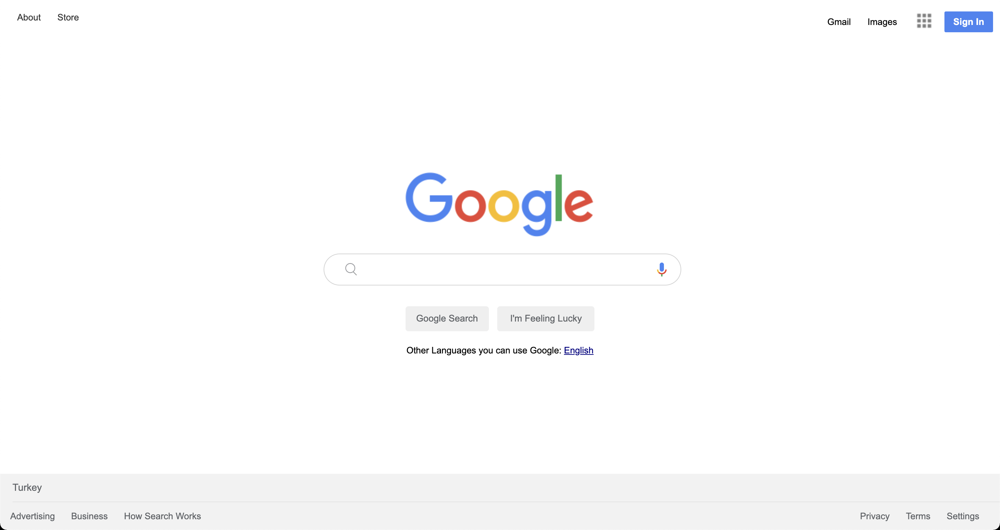

# Google-Landing-Page

## Description

Project aims to create google landing page.

## Project Skeleton

```
google-landing-page (folder)
|
|----readme.md
|----images
        |----appicon.png
        |----gfavicon.png
        |----google_microphone.png
        |----googlelogo.png
        |----icon-menu.jpg
        |----magnifying_glass.png
|----index.html
|----style.css
```

## Expected Outcome



### At the end of the project, following topics are to be covered;

- HTML

- List Properties-Tables / CSS-The Display Property-The position Property

- Overflow Property-The float Property-Opacity / Transparency-Units in CSS

- CSS Setting height and width-CSS Outline-CSS Combinators

- improved coding skills within HTML & CSS

- used git commands (push, pull, commit, add etc.) and Github as Version Control System.

<p align='center'> ⌛ Happy Coding ✍ - Please feel free to check my work ! 🙃 </p>
